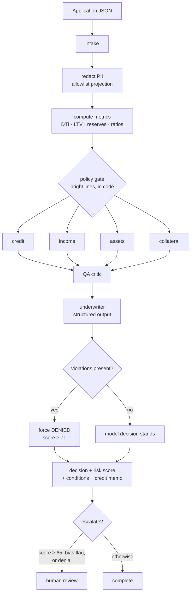

# Architecture

## The mental model

A manila folder walks around an office. It stops at desks. Each desk reads the folder,
writes a memo, staples it in, and puts the folder back. A supervisor decides who's next.
A proofreader reads all the memos looking for contradictions. The boss stamps it.

Everything below is one of those things.

| Code | Office equivalent |
|---|---|
| `UnderwritingState` | the folder — every fact the case can hold |
| an agent node | a desk |
| `add_edge` / `add_conditional_edges` | arrows painted on the floor |
| LangGraph runtime | the clerk pushing the cart |
| `MemorySaver` | a photocopier at every desk |
| `retrieve_policies()` | the librarian who fetches two pages, not the binder |
| `sanitize_pii()` | the black marker, applied before anything leaves the building |

## Flow



The four specialists have no data dependency on each other, so they fan out. Wall-clock is
the slowest specialist rather than the sum of all four.

## State and merge semantics

`UnderwritingState` is a `TypedDict`. Each field's annotation decides how a write merges.

```python
final_decision:  Optional[str]                        # overwrite — one current value
reasoning_chain: Annotated[list[str], operator.add]   # accumulate — the audit trail
```

This distinction is load-bearing. Because the audit fields accumulate, each agent returns
**only what it just produced**:

```python
return {
    "credit_analysis": analysis,
    "bias_flags": detect_bias_signals(analysis, ...),   # just mine
    "reasoning_chain": ["Credit Analyst: analysis complete"],
}
```

The alternative style — rebuilding the whole list with `state.get("reasoning_chain", []) + [...]`
— works only when agents run strictly one at a time. Under fan-out, four agents each read the
list before any of them wrote, so three contributions are lost. The two styles are mutually
exclusive; mixing them duplicates entries instead.

`tests/test_graph.py` asserts the annotations directly, so removing a reducer fails a test
rather than silently corrupting the trail.

## Where the model is, and isn't

```
┌──────────────────────── deterministic ────────────────────────┐
│  PII redaction · ratio computation · policy gate · routing    │
│  rate limiting · decision-vs-violation reconciliation         │
└───────────────────────────────────────────────────────────────┘
                              │  facts injected as settled
                              ▼
┌──────────────────────── probabilistic ────────────────────────┐
│  reading the situation · weighing compensating factors        │
│  drafting conditions · writing the memo                       │
└───────────────────────────────────────────────────────────────┘
                              │  output validated against a schema
                              ▼
┌──────────────────────── deterministic ────────────────────────┐
│  bias scan · violation override · escalation rules            │
└───────────────────────────────────────────────────────────────┘
```

The model is sandwiched. Everything with a right answer happens in code; the model handles
the "it depends", and both its input and its output are constrained.

## Retrieval

Build once at start-up: load the PDF (14 pages) → split into ~1000-character chunks with
200 characters of overlap → embed → store in Chroma.

Per query: embed the question, take the `k` nearest chunks, group them by section heading and
deduplicate. Grouping matters because overlapping chunks mean the same paragraph often appears
three times in six results.

Each desk retrieves with its own query, so the credit agent never sees appraisal rules.

**The failure mode to watch:** retrieval optimises for *resemblance*, and you need
*correctness*. A table-of-contents line scores well against "self-employment rules" and
contains none. Nothing downstream notices the difference — which is why a hallucination is
usually a retrieval bug wearing a model costume.

## Streaming

`POST /api/run/{case_id}` returns `text/event-stream`. `graph.astream()` yields one chunk per
completed node; the handler converts each into an SSE frame with the node name, elapsed time,
that node's analysis, and any new flags. The browser paints each desk as it lands rather than
waiting for the whole run.

`EventSource` only issues GETs, so the client reads the `fetch` body stream and parses frames
manually.

## Extending it

**A fifth specialist** is a `SpecialistSpec` in `specialists.py` plus one line in
`SPECIALIST_ORDER`. The graph builder picks it up; nothing else changes.

**A different domain** keeps the whole skeleton. Swap the policy PDF, the calculators, the four
specs, and the decision schema. Claims triage, contract review, clinical intake and resume
screening are all the same shape: redact → compute → retrieve → specialise → critique → decide.

## What would need to change for production

- Durable checkpointer (`PostgresSaver`) instead of `MemorySaver`.
- `interrupt_before=["human_review"]` so escalation genuinely pauses the graph rather than
  flagging after the fact.
- Redis-backed rate limiting for multi-instance deployment.
- A persisted vector index with a re-index pipeline triggered by policy updates, plus version
  metadata so retrieval can prefer the current revision. Embeddings encode meaning, not recency.
- An evaluation set of historical decisions with known loan performance, run on every prompt
  change. Three fixtures prove the pipeline executes; they cannot measure fairness.
- Disparate-impact testing across demographic groups — which requires collecting the very
  attributes the system is forbidden to decide on, held separately from the decision path.
